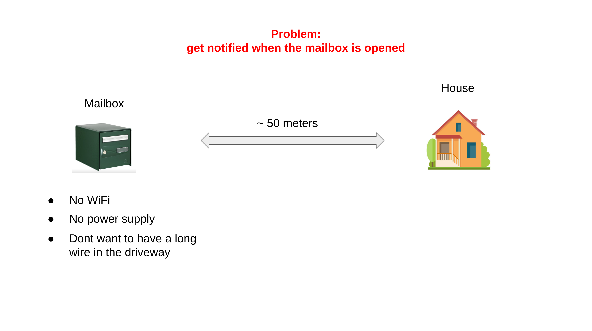
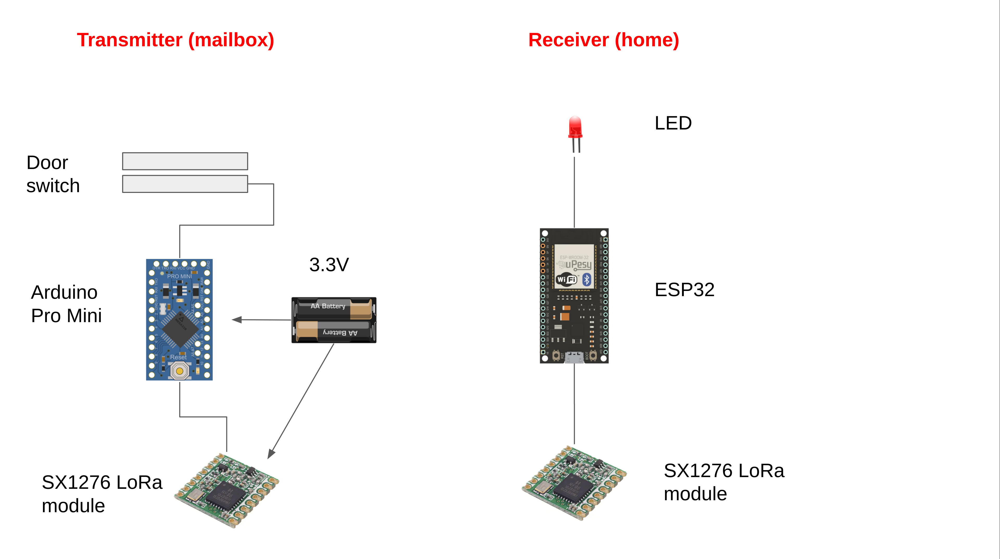
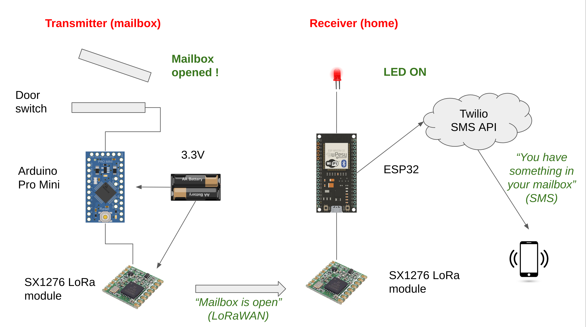

# Mailbox notifier with LoRa and SMS API

This project aims at providing a mailbox notifier when it s opened (presumably by the postman). It relies on LoRa technologoy where the transmitter located in the mailbox sends a LoRaWAN alert to the receiver located in the house and set a LED on. If the house has WiFi, it then push a SMS (using Twilio free SMS API) to the desired recipient to warn him that he has a mail waiting for him in the mailbox.

For a full context understanding, please visit:

https://www.youtube.com/watch?v=VwmAAkHYImQ&ab_channel=antoinekeller

<em>Problem to solve</em> 

<em>Hardware</em> 

<em>When the mailbox is opened</em> 

# Wiring

## Transmitter: Arduino Pro Mini and SX 1276 (LoRa module)

|  Arduino Pro Mini |  SX 1276 |
| :----:   |  :----: |
| 13 | SCK |
| 12 | MISO |
| 11 | MOSI |
| 10 | NSS |
| 9 | RST |
| 2 | DI00 |
| A0 | Door switch (not SX1276) |

## Receiver: ESP32 and SX 1276 (LoRa module)

|  ESP32 |  SX 1276 |
| :----:   |  :----: |
| D19 | MISO |
| D23 | MOSI |
| D18 | SCK |
| D5 | NSS |
| D14 | RST |
| D4 | DI00 |
| D13 | LED (not SX1276) |

# SMS API

I used  Twilio for my SMS API https://www.twilio.com/

Many other companies offer similar service for free.